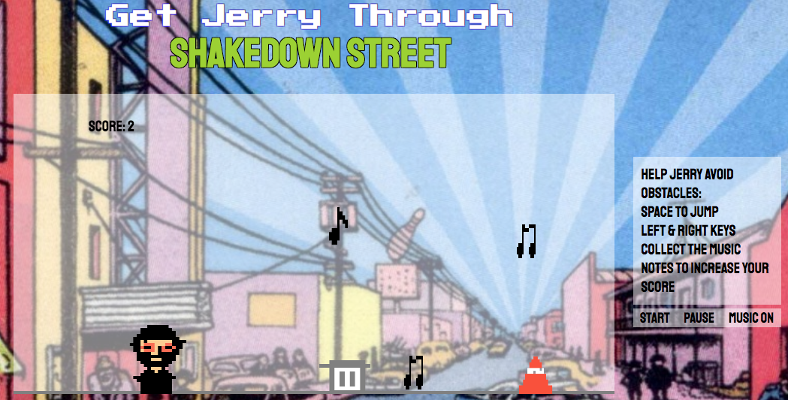

## Get Jerry Through Shakedown Street
[Live link](https://wfalcone13.github.io/JerryShakedown/)

### Overview
Get Jerry Through Shakedown Street is a side scroller adventure game inspired by the band, the Grateful Dead. The objective of the game is to help Jerry avoid the trash can and cone obstacles while collecting the music notes and power-ups to achieve the highest score possible.

### Enhanced Features

#### 🎮 **Multiple Lives System**
- Jerry starts with 3 lives 
- Visual indicator shows remaining lives
- Brief invincibility period after losing a life (2 seconds)
- Game ends when all 3 lives are lost

#### ⚡ **Power-ups**
- **Invincibility** (Gold): Makes Jerry temporarily immune to obstacles (8 seconds)
- **Double Jump** (Blue): Allows Jerry to jump twice in mid-air (10 seconds)  
- **Speed Boost** (Green): Increases Jerry's movement speed (6 seconds)
- Power-ups have visual effects, timers, and pulsing animations
- Visual indicators show active power-up status

#### 📈 **Progressive Difficulty**
- Game gets progressively harder as score increases
- **Level 1**: Speed = -4, Note Value = 5
- **Level 2**: Speed = -7, Note Value = 6 (at 300 points)
- **Level 3**: Speed = -10, Note Value = 8 (at 600 points)
- **Level 4**: Speed = -12, Note Value = 10 (at 1000 points)
- Visual level indicator shows current difficulty

#### 🎯 **Enhanced Game Mechanics**
- **Improved Physics**: Proper gravity, jumping mechanics, and ground collision
- **Better Collision Detection**: Robust collision system with tolerance for better gameplay
- **Random Object Positioning**: Obstacles and collectibles appear at random heights
- **Smooth Animations**: Visual feedback and power-up effects
- **Enhanced UI**: Lives counter, level indicator, and power-up status display

#### 🛡️ **Collision System**
- **Enhanced Detection**: Improved collision bounds with tolerance
- **Invincibility System**: Brief invincibility after losing a life
- **Visual Feedback**: Jerry becomes semi-transparent when invincible
- **Debug Logging**: Console logs for collision detection (for development)

### Play
Users can start game with the Enter Key. Pause game with P key. Toggle music with the M key. Users can move the Jerry Figure with the left and right keys and can have Jerry jump with the spacebar. The score will increase until Jerry runs out of lives. Jerry can collect music notes to increase score and power-ups for special abilities. When Jerry hits an obstacle, he loses a life and gets brief invincibility. The game ends when all lives are lost.

### Controls
- **Arrow Keys**: Move left and right
- **Spacebar**: Jump (double jump when power-up is active)
- **Enter**: Start game / restart after game over
- **P**: Pause/unpause game
- **M**: Toggle music

### Game Objects

#### 🚮 **Obstacles**
- **Trash Cans**: 75×50px, ground level obstacles
- **Traffic Cones**: 50×50px, ground level obstacles
- Both move from right to left at varying speeds
- Both cause Jerry to lose a life when hit
- Both respawn with random positions

#### 🎵 **Collectibles**
- **Music Notes**: Floating collectibles worth 5-10 points
- **Random Heights**: Appear at various heights (150-300px)
- **Floating Animation**: Gentle up/down movement
- **Progressive Value**: Worth more points at higher levels

#### ⚡ **Power-ups**
- **Invincible Power-up** (Gold): 8-second immunity
- **Double Jump Power-up** (Blue): 10-second double jump ability
- **Speed Boost Power-up** (Green): 6-second speed increase
- **Pulsing Animation**: Visual effect to attract attention
- **Slower Movement**: Move slower than obstacles for easier collection

### Technologies
- `Canvas` for the game board and figures 
- `Javascript` to create game play with enhanced object-oriented design
- `CSS` to style the page
- `HTML5` for page layout
- `Firebase` for score persistence
- `Webpack` for module bundling

### Recent Improvements & Fixes
- ✅ Enhanced game state management with proper reset functionality
- ✅ Multiple lives system with visual indicators
- ✅ Power-up system with visual effects and timers
- ✅ Progressive difficulty scaling with speed and point multipliers
- ✅ Improved collision detection with tolerance and debugging
- ✅ Better physics and movement mechanics
- ✅ Enhanced UI with status indicators and level display
- ✅ Modular code architecture with proper inheritance
- ✅ Object-oriented design patterns
- ✅ Random object positioning for variety
- ✅ Fixed drawing parameters for proper rendering
- ✅ Enhanced debugging and console logging
- ✅ Improved high score submission with proper input cleanup
- ✅ Fixed Firebase configuration and export issues

### Development Features
- **Console Logging**: Detailed collision detection and game state logging
- **Debug Mode**: Visual collision bounds and position tracking
- **Error Handling**: Robust error handling for Firebase operations
- **Code Organization**: Clean, modular structure with proper separation of concerns

### Future Enhancements
- Mobile touch controls
- Additional power-up types
- Multiple game modes
- Sound effects and enhanced audio
- Particle effects and visual polish
- Achievement system
- Social features and sharing

