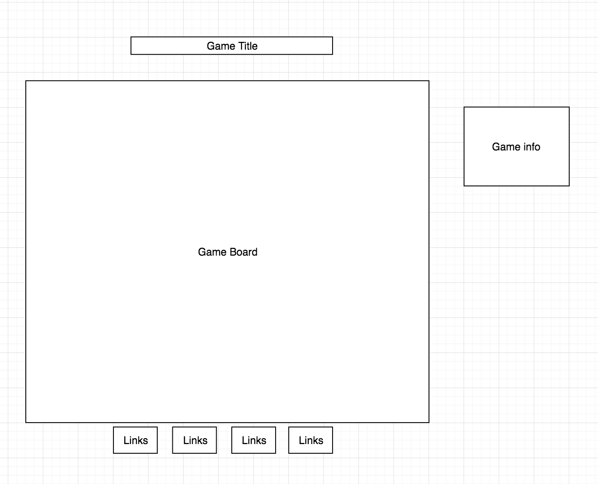

## Get Jerry Through Shakedown Street

### Background
Get Jerry Through Shakedown Street is a side scroller adventure game inpired by the band, the Grateful Dead. 

### Functionality & MVP  
In Get Jerry Through Shakedown Street users will be able to:
- [ ] Start the game
- [ ] Make Jerry jump over obstacles 
- [ ] Toggle between music on/off

In addition, this project will include:
- [ ] A production README

### Wireframes
This game will consist of a single screen with a game board, the main title, links to my Github, linkedIn, Personal site and Game Repo. Game button will be the space bar to make Jerry jump. On the right side will include info about the game, instructions and option to change music on/off

### Architecture and Technologies
- [ ] Javascript
- [ ] CSS
- [ ] HTML5
- [ ] Webpack
- [ ] Canvas

### Implementation Timeline
**Day 1**:
  Plan out Canvas and Javascript work

**Day 2**:
  Begin work and design

**Day 3**:
  Continue work
  
**Day 4**:
Style the front end

### Bonus Features 
- [ ] Track highscores
- [ ] Change music tracks
- [ ] Add animations
